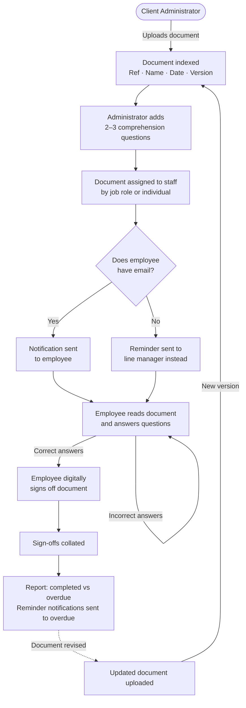

# Document Portal

A document management portal built with Next.js 16 App Router, Azure Blob Storage, and Azure Table Storage. Supports file browsing, upload, versioning, sharing, document scanning, and role-based access control.

## How It Works

The platform manages the distribution, acknowledgement, and sign-off of Health & Safety documents. It ensures the right people receive the right documents, confirms they have read and understood them, and provides a full audit trail.



### Workflow Steps

**1 — Upload a Document**

The Client Administrator uploads a document (e.g. a Policy Document) in the required format. The system automatically indexes it with a document reference number, name, issue date, and version number.

**2 — Add Comprehension Questions**

The Client Administrator sets 2–3 questions about the document content. Users must answer these correctly before they can sign off, confirming they have read and understood the document.

**3 — Assign to Relevant Staff**

The Client Administrator assigns the document to the relevant employees. Assignment can be based on job role, so that (for example) only Engineers receive engineering-specific documents, avoiding manual selection each time.

**4 — Distribution**

The document is distributed to assigned users. Employees with an email address receive a notification and complete the sign-off via their email login. Employees without an email address can sign off using a name-entry option instead, and reminders are sent to their line manager rather than directly to them.

**5 — Read, Answer, and Sign**

The user reads the document, answers the comprehension questions correctly, and digitally signs it off.

**6 — Tracking and Reporting**

The platform collates all sign-offs and produces a report showing who has completed the sign-off and who is overdue. Automated reminder notifications can be configured to chase outstanding sign-offs.

**7 — Document Updates**

When a document is revised, the Client Administrator uploads the new version. The system repeats from step 1, adding the new version to the index while retaining all previous version records.

### Administrator Responsibilities

The Client Administrator is responsible for:
- Uploading and managing documents
- Maintaining the employee list (name, email if applicable, job role)
- Assigning documents to the correct job roles or individuals
- Configuring reminder notifications

## Tech Stack

- **Framework:** Next.js 16 (App Router, standalone Docker output)
- **Auth:** NextAuth.js v4 with Credentials provider
- **Storage:** Azure Blob Storage (files) + Azure Table Storage (activity logs)
- **Database:** Neon PostgreSQL (users, password resets) via Prisma ORM
- **Email:** Azure Communication Services — managed sending domain, no custom domain required
- **Styling:** Tailwind CSS v4, Radix UI
- **Infrastructure:** Terraform on Azure App Service, deployed via Docker

## Local Development

### Prerequisites

- Node.js 22+
- Azurite (Azure Storage emulator) — choose one:
  - **VS Code extension** (recommended): install [Azurite](https://marketplace.visualstudio.com/items?itemName=Azurite.azurite) from the VS Code marketplace, then use the command palette (`Ctrl+Shift+P` → "Azurite: Start")
  - **npx** (no install): `npx azurite --silent` (run from the project root)
  - **Global npm**: `npm install -g azurite` then `azurite --silent`
  - **Docker**: `docker run -p 10000:10000 -p 10001:10001 -p 10002:10002 mcr.microsoft.com/azure-storage/azurite`

  Azurite writes `__azurite_db_*.json` state files to wherever it is started — these are gitignored if you run it from the project root.

  Set `AZURE_STORAGE_CONNECTION_STRING` to the Azurite default connection string:
  ```
  DefaultEndpointsProtocol=http;AccountName=devstoreaccount1;AccountKey=Eby8vdM02xNOcqFlqUwJPLlmEtlCDXJ1OUzFT50uSRZ6IFsuFq2UVErCz4I6tq/K1SZFPTOtr/KBHBeksoGMGw==;BlobEndpoint=http://127.0.0.1:10000/devstoreaccount1;
  ```

### Setup

1. Install dependencies:
   ```bash
   npm install
   ```

2. Create `.env.local`:
   ```env
   AZURE_STORAGE_CONNECTION_STRING=
   AZURE_STORAGE_CONTAINER_NAME=documents
   NEXTAUTH_SECRET=any-random-string-for-local-dev
   NEXTAUTH_URL=http://localhost:3000
   DEFAULT_ADMIN_EMAIL=your@email.com
   AZURE_COMMUNICATION_CONNECTION_STRING=  # from Azure portal (ACS resource → Keys)
   ACS_SENDER_ADDRESS=                     # e.g. DoNotReply@<uuid>.azurecomm.net
   USE_AZURITE=true
   DATABASE_URL=postgresql://...           # Neon connection string (or local PostgreSQL)
   ```

3. Apply the database schema (run once, and again after schema changes):
   ```bash
   npx prisma migrate dev
   ```

4. Seed the initial admin user:
   ```bash
   node scripts/seed-admin.js <password> "Display Name"
   ```

5. Start Azurite (see Prerequisites above), then run the dev server:
   ```bash
   npm run dev
   ```

### Available Commands

```bash
npm run dev          # Start development server
npm run build        # Build for production
npm run lint         # Run ESLint
npm run format       # Format with Prettier
npm run checks       # Lint + format check + TypeScript + tests (full quality gate)
npm test             # Run all tests
npm run test:watch   # Run tests in watch mode
npm run test:coverage # Run tests with coverage report
npm run test:e2e     # Run Playwright E2E tests (requires dev server)
npm run test:e2e:ui  # Open Playwright UI mode
```

## Testing

Tests are written with [Vitest](https://vitest.dev/) and live alongside the code they test.

### Structure

| Location | Type | What's covered |
|---|---|---|
| `src/lib/__tests__/` | Unit | `user-database` (including `jobRole`, `lineManagerId`, no-email worker creation, `resolveEmailRecipients` with line manager routing and deduplication), `password-reset`, `activity-logger`, `storage`, `url-shortener`, `version-manager`, `list-blobs`, `utils`, `assignments` (including `targetJobRoles` filtering), `completion-records` (including `getAssignmentStatusSummary`), `email` (`sendAssignmentNotification`, `sendReminderNotification`), `reminders` (`isReminderDay`, `getAssignmentsNeedingReminders` with no-email line manager routing) |
| `src/lib/file-system/__tests__/` | Unit | `file-operations`, `folder-operations`, `format-utils`, `path-utils` |
| `src/app/api/__tests__/` | Integration | `health`, admin user CRUD (including `jobRole` and `lineManagerId`), `forgot-password`, `reset-password`, document routes (`upload`, `download`, `delete`, `move`, `rename`, `share`, `versions`), admin companies/templates (including comprehension questions)/assignments (including `dueDate`, `targetJobRoles`, assignment notification emails, and no-email line manager routing)/completions (including status summary with outstanding users and overdue), customer assignments (including `jobRole` filtering)/completions (including comprehension answer validation and PDF download), cron reminders, kiosk sign-off (`GET` worker list, `POST` completion with worker validation and comprehension check) |
| `e2e/` | E2E (Playwright) | Auth page UI, protected-route redirects, kiosk sign-off flow (company page, worker selection, form completion, success screen), admin dashboard (stats, navigation), customer documents (pending/complete split, button labels) |

Unit tests mock the Prisma client and Azure SDKs directly and test `src/lib/` functions in isolation. Integration tests call API route handlers end-to-end, mocking only external services (Prisma client, Azure SDKs, email client, NextAuth session) — the full path through route handler → lib function → mocked infrastructure is exercised. E2E tests run against the real Next.js dev server; API responses are intercepted with `page.route()` so no database or Azure credentials are required.

**Test discipline:** Update tests whenever code changes. Add new tests whenever new code is added. Run `npm run checks` before every commit.

### Running tests

```bash
npm test                  # Run all unit + integration tests once
npm run test:watch        # Re-run on file changes
npm run test:coverage     # Generate coverage report (output in coverage/)
npm run test:e2e          # Run Playwright E2E tests (starts dev server automatically)
npm run test:e2e:ui       # Open Playwright UI mode for interactive debugging
```

Unit/integration tests run in CI on every PR and release — no Azure credentials or running services are needed. E2E tests also run in CI (`e2e-tests.yml`) against a locally-started dev server; only `NEXTAUTH_SECRET` is required as a secret (all API responses are mocked). The Playwright report is uploaded as a build artifact on every run.

## Email (Password Reset)

Transactional email is handled by [Azure Communication Services (Email)](https://azure.microsoft.com/en-us/products/communication-services). An Azure-managed sending domain (`DoNotReply@<uuid>.azurecomm.net`) is provisioned automatically by Terraform — no custom domain ownership or DNS setup required. Free tier: 100 emails/day.

The ACS resources are defined in `infrastructure/modules/communication_service/`. Running `terraform apply` provisions everything and injects the connection string and sender address into the App Service via Key Vault.

## CI/CD

| Trigger | Workflow | What happens |
|---|---|---|
| PR opened/updated → `main` | `pr-check.yml` | Lint, security scan, E2E tests — all in parallel; Docker build (no push) gates on all three |
| Merge to `main` | `dev-deploy.yml` | Lint, security scan, E2E tests — all in parallel; build+push, DB migrate, deploy to dev, smoke test |
| Release published in GitHub UI | `prod-deploy.yml` | Lint + E2E tests in parallel; build+push, DB migrate, deploy to prod, smoke test |

The smoke test polls `GET /api/health` (up to 12 × 15 s = 3 min) and fails the deployment if the app does not return `{ "status": "ok" }`. The health endpoint checks both the PostgreSQL database and Azure Blob Storage.

To release to production: go to **GitHub → Releases → Draft a new release**, choose a tag (e.g. `v1.2.3`), and publish. The prod deploy triggers automatically.

## Infrastructure

Azure resources are defined with Terraform in `infrastructure/`. See `infrastructure/readme.md` for provisioning steps.

Modules:
- `resource_group` — Azure resource group
- `storage` — Blob Storage account and containers
- `key_vault` — Key Vault for secrets
- `app_service` — App Service plan and web app (Docker)
- `document_intelligence` — Azure AI Document Intelligence
- `communication_service` — Azure Communication Services for email

Environments are configured in `infrastructure/env/dev/` and `infrastructure/env/prod/`.

## Deployment

Docker images are built and pushed to GitHub Container Registry (`ghcr.io`) by GitHub Actions, then pulled by Azure App Service.

- Dev image tag: `dev-latest`
- Prod image tags: `latest`, `v<version>`, and the commit SHA
