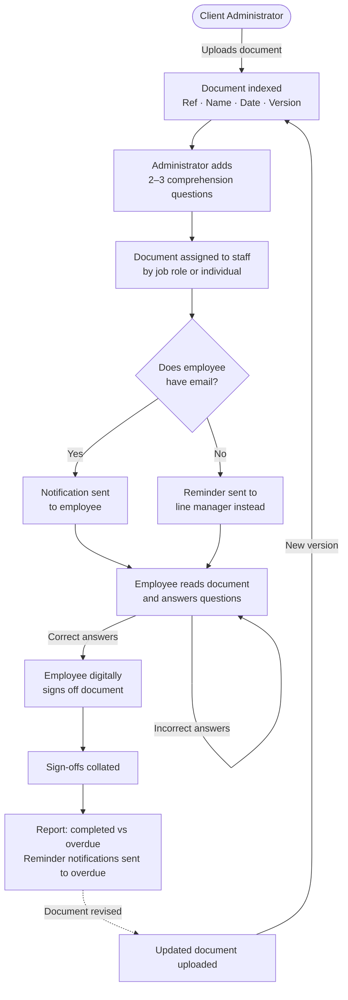

# Minato

A Health & Safety document management platform built with Next.js 16 App Router, Azure Blob Storage, and Azure Table Storage. Supports file browsing, upload, versioning, sharing, document scanning, and role-based access control.

## How It Works

The platform manages the distribution, acknowledgement, and sign-off of Health & Safety documents. It ensures the right people receive the right documents, confirms they have read and understood them, and provides a full audit trail.


```mermaid
flowchart TD
    A([Client Administrator]) -->|Uploads document| B[Document indexed\nRef · Name · Date · Version]
    B --> C[Administrator adds\n2–3 comprehension questions]
    C --> D[Document assigned to staff\nby job role or individual]
    D --> E{Does employee\nhave email?}
    E -->|Yes| F[Notification sent\nto employee]
    E -->|No| G[Reminder sent to\nline manager instead]
    F --> H[Employee reads document\nand answers questions]
    G --> H
    H -->|Correct answers| I[Employee digitally\nsigns off document]
    H -->|Incorrect answers| H
    I --> J[Sign-offs collated]
    J --> K[Report: completed vs overdue\nReminder notifications sent to overdue]
    B2[Updated document uploaded] -->|New version| B
    K -.->|Document revised| B2
```

### Workflow Steps

**1 — Upload a Document**

The Client Administrator uploads a document (e.g. a Policy Document) in the required format. The system automatically indexes it with a document reference number, name, issue date, and version number.

**2 — Add Comprehension Questions**

The Client Administrator sets 2–3 questions about the document content. Users must answer these correctly before they can sign off, confirming they have read and understood the document.

**3 — Assign to Relevant Staff**

The Client Administrator assigns the document to the relevant employees. Assignment can be based on job role, so that (for example) only Engineers receive engineering-specific documents, avoiding manual selection each time.

**4 — Distribution**

The document is distributed to assigned users. Employees with an email address receive a notification and complete the sign-off via their email login. Employees without an email address can sign off using a name-entry option instead, and reminders are sent to their line manager rather than directly to them.

**5 — Read, Answer, and Sign**

The user reads the document, answers the comprehension questions correctly, and digitally signs it off.

**6 — Tracking and Reporting**

The platform collates all sign-offs and produces a report showing who has completed the sign-off and who is overdue. Automated reminder notifications can be configured to chase outstanding sign-offs.

**7 — Document Updates**

When a document is revised, the Client Administrator uploads the new version. The system repeats from step 1, adding the new version to the index while retaining all previous version records.

### Administrator Responsibilities

The Client Administrator is responsible for:
- Uploading and managing documents
- Maintaining the employee list (name, email if applicable, job role)
- Assigning documents to the correct job roles or individuals
- Configuring reminder notifications

## Tech Stack

- **Framework:** Next.js 16 (App Router, standalone Docker output)
- **Auth:** NextAuth.js v4 with Credentials provider
- **Storage:** Azure Blob Storage (files) + Azure Table Storage (activity logs)
- **Database:** Neon PostgreSQL (users, password resets) via Prisma ORM
- **Email:** Azure Communication Services — managed sending domain, no custom domain required
- **Styling:** Tailwind CSS v4, Radix UI
- **Infrastructure:** Terraform on Azure App Service, deployed via Docker

## Local Development

### Prerequisites

- Node.js 22+
- Docker (for Postgres, Azurite and Gotenberg — see below)

Postgres, Azurite (Azure Storage emulator) and Gotenberg (Word→PDF conversion) run locally via `docker-compose.yml`:

```bash
npm run docker:up     # starts postgres, azurite and gotenberg, waits until healthy
npm run docker:down   # stops them
npm run docker:logs   # tails logs from all three
```

This replaces running Neon in the cloud for local dev — no external dependency needed, and it sidesteps Neon's free-tier compute-hour quota. Data persists in Docker volumes across restarts (`docker compose down -v` to wipe them).

If you'd rather run these individually instead of via Docker Compose (e.g. the VS Code Azurite extension), see the connection details in `.env.example`.

### Setup

1. Install dependencies:
   ```bash
   npm install
   ```

2. Create `.env.local` (copy `.env.example` — its defaults already match the Docker Compose stack):
   ```bash
   cp .env.example .env.local
   ```
   Then fill in `NEXTAUTH_SECRET`, `DEFAULT_ADMIN_EMAIL`, and (if testing email) `AZURE_COMMUNICATION_CONNECTION_STRING`/`ACS_SENDER_ADDRESS`.

3. Start the backing services:
   ```bash
   npm run docker:up
   ```

4. Apply the database schema (run once, and again after schema changes):
   ```bash
   npx prisma migrate deploy
   ```

5. Create the blob container (once per fresh Azurite volume — real Azure Storage containers are provisioned by Terraform instead):
   ```bash
   node scripts/create-storage-container.js
   ```

6. Seed the initial admin user (uses `DEFAULT_ADMIN_EMAIL` from `.env.local`; safe to re-run — skips if that email already exists):
   ```bash
   node scripts/seed-admin.js <password> "Display Name"
   ```

7. Seed sample companies/templates/assignments (optional, but you'll otherwise sign in to an empty app). Not idempotent — re-running against a non-empty DB creates duplicates, so only run once per fresh volume:
   ```bash
   npm run db:seed
   ```
   Creates 5 companies, 15 users (password `Password123!`), 20 document templates, and a mix of overdue/upcoming/completed assignments so the app looks in-use.

8. Run the dev server:
   ```bash
   npm run dev
   ```

> If you also run Azurite outside Docker (VS Code extension, global npm install, etc.), stop it first — it binds the same ports and will silently shadow the Docker container on `127.0.0.1`.

### Available Commands

```bash
npm run dev          # Start development server
npm run build        # Build for production
npm run lint         # Run ESLint
npm run format       # Format with Prettier
npm run checks       # Lint + format check + TypeScript + tests (full quality gate)
npm test             # Run all tests
npm run test:watch   # Run tests in watch mode
npm run test:coverage # Run tests with coverage report
npm run docker:up    # Start local Postgres, Azurite and Gotenberg
npm run docker:down  # Stop them
npm run docker:logs  # Tail their logs
```

## Testing

Tests are written with [Vitest](https://vitest.dev/) and live alongside the code they test.

### Structure

| Location | Type | What's covered |
|---|---|---|
| `src/lib/pdf/__tests__/` | Unit | `completion-pdf` (`generateCompletionPDF` renders a buffer covering every field type, including `file` and `section`, and embeds a signature image when `signatureDataUrl` is provided) |
| `src/lib/__tests__/` | Unit | Includes `document-text-extraction` (`extractTextFromPdfBuffer` — mocked `pdfjs-dist` legacy build, page/character caps, parse-failure error), `comprehension-question-source` (`getTemplateSourceText` — form vs upload branch, missing-blob-path and too-short-extracted-text errors), `comprehension-question-generation` (`generateComprehensionQuestions` — mocked `fetch` against the Azure AI Foundry chat-completions endpoint, invalid-answer filtering, all-invalid and non-ok-response error paths) |
| `src/app/api/__tests__/` | Integration | `health` (liveness) and `health/deep` (DB + Blob Storage dependency checks), admin user CRUD (including `jobRole`, `lineManagerId`, and `customerCompanyName` resolution), user registration (`/api/auth/register`, including auto-enrolment on creation), `forgot-password`, `reset-password`, document routes (`upload`, `download`, `delete`, `move`, `rename`, `share`, `versions`), admin companies/templates (including comprehension questions, required `changeReason` on publish, and upload-based template fields on create/publish-version)/version-history (combined current + past versions, resolved author names)/assignments (including `dueDate`, `targetJobRoles`, `autoEnroll`, assignment notification emails, and no-email line manager routing)/completions (including status summary with outstanding users and overdue; the company completions list groups one row per template, dropping superseded versions and merging same-version assignments into aggregated counts; `GET /api/admin/companies/[id]/completions/[templateId]` returns the merged detail view)/outstanding completions (admin-only)/company-created templates (read-only, admin-only), admin activity logs, admin dashboard stats + compliance KPIs, admin/customer-admin template document upload (`upload-document` routes — auth, size limit, unsupported-type 400, conversion-failure 500, success), admin template document view (`GET /api/admin/templates/[id]/document` — auth, template-not-found 404, non-upload-template 404, success SAS URL, 500 on SAS failure), admin generated comprehension questions (`POST /api/admin/templates/[id]/generate-questions` — auth, 404, 400 on source-text failure, 500 on generation failure, success), customer assignments (including `jobRole` filtering, required-field validation for number/select/file/section form field types, the upload-based document SAS view route, the fill-and-return submission upload route + its enforcement on `/complete`, and required `signatureDataUrl` validation on `/complete` with pass-through to PDF generation)/completions (including comprehension answer validation and PDF download), customer admin completions, customer admin self-serve templates (`GET`/`POST`/`PATCH`/`DELETE` scoped to `ownerCompanyId`, ownership-checked 404s, `publish-version`, upload-based template fields), customer admin assignments (company-wide assignment creation restricted to that company's own templates) and users (job-role lookup for the assign dialog), profile self-service (including `jobRole`-change auto-enrolment), cron reminders (including `lastReminderSentAt` update), kiosk sign-off (`GET` worker list, `POST` completion with worker validation, comprehension check, and required `signatureDataUrl` validation, including new field type validation), file-field uploads (`upload-file` routes for both the authenticated and kiosk completion flows — auth, field-type validation, 10MB size limit, success), admin dashboard `completedThisWeek` KPI (Monday-start week, unit-tested directly against mocked Prisma), admin all-assignments and completions-history drill-down routes (`GET /api/admin/assignments`, `GET /api/admin/completions/history`), document template `category` field (create/update/publish-version passthrough, both admin and customer-admin routes) |

Unit tests mock the Prisma client and Azure SDKs directly and test `src/lib/` functions in isolation. Integration tests call API route handlers end-to-end, mocking only external services (Prisma client, Azure SDKs, email client, NextAuth session) — the full path through route handler → lib function → mocked infrastructure is exercised.

**Test discipline:** Update tests whenever code changes. Add new tests whenever new code is added. Run `npm run checks` before every commit.

### Running tests

```bash
npm test                  # Run all tests once
npm run test:watch        # Re-run on file changes
npm run test:coverage     # Generate coverage report (output in coverage/)
```

All tests run in CI on every PR and release — no Azure credentials or running services are needed.

## Email (Password Reset)

Transactional email is handled by [Azure Communication Services (Email)](https://azure.microsoft.com/en-us/products/communication-services). An Azure-managed sending domain (`DoNotReply@<uuid>.azurecomm.net`) is provisioned automatically by Terraform — no custom domain ownership or DNS setup required. Free tier: 100 emails/day.

The ACS resources are defined in `infrastructure/modules/communication_service/`. Running `terraform apply` provisions everything and injects the connection string and sender address into the App Service via Key Vault.

## CI/CD

| Trigger | Workflow | What happens |
|---|---|---|
| PR opened/updated → `main` | `pr-check.yml` | Lint, security scan, Docker build (no push) |
| Merge to `main` | `dev-deploy.yml` | Lint, security scan, build+push, DB migrate, deploy to dev, smoke test |
| Release published in GitHub UI | `prod-deploy.yml` | Build+push, DB migrate, deploy to prod, smoke test |

The smoke test polls `GET /api/health/deep` (up to 12 × 15 s = 3 min) and fails the deployment if the app does not return `{ "status": "ok" }`. That route checks both the PostgreSQL database and Azure Blob Storage. `GET /api/health` (the path Azure App Service's built-in health monitor pings continuously) is a plain liveness check with no dependency calls — it stays cheap on purpose so it doesn't keep the Neon compute endpoint awake around the clock and defeat autosuspend.

To release to production: go to **GitHub → Releases → Draft a new release**, choose a tag (e.g. `v1.2.3`), and publish. The prod deploy triggers automatically.

## Infrastructure

Azure resources are defined with Terraform in `infrastructure/`. See `infrastructure/readme.md` for provisioning steps.

**Terraform version:** 1.15+ required.

Modules:
- `resource_group` — Azure resource group
- `storage` — Blob Storage account and containers
- `key_vault` — Key Vault for secrets
- `app_service` — App Service plan and web app (Docker)
- `document_intelligence` — Azure AI Document Intelligence
- `communication_service` — Azure Communication Services for email
- `gotenberg` — Azure Container App (Consumption plan) running Gotenberg, converts uploaded Word documents to PDF; locked down with basic auth rather than VNet-isolated, since the App Service Plan is on the Free (F1) SKU (see `future-considerations.md` P19 for the tradeoff)

Environments are configured in `infrastructure/env/Development/` and `infrastructure/env/Production/`.

### Terraform State Backend

Remote state is stored in Azure Blob Storage and accessed using Azure AD authentication (`ARM_USE_AZUREAD=true`) — no storage account keys are used. The CI/CD workflows set this via environment variable; no extra backend config is needed.

### Bootstrap (first-time setup)

Before running the main Terraform environments, provision the state storage account and grant the CI/CD service principal access:

```bash
cd infrastructure/bootstrap/Development   # or Production
terraform init
terraform apply \
  -var="subscription_id=<SUB_ID>" \
  -var="cicd_sp_object_id=<SP_OBJECT_ID>"
```

This creates the resource group, storage account, container, and assigns `Storage Blob Data Contributor` to the SP. Without this role assignment the backend init will fail with a 403 `AuthorizationPermissionMismatch`.

**If the role assignment was created manually** (e.g. via CLI before the bootstrap was updated), import it into state so Terraform tracks it:

```bash
# 1. Find the role assignment resource ID
az role assignment list \
  --scope "/subscriptions/<SUB_ID>/resourceGroups/rg-terraform-state-dev-uks/providers/Microsoft.Storage/storageAccounts/tfstateminatodevuks" \
  --role "Storage Blob Data Contributor" \
  --query "[].id" -o tsv

# 2. Import it
terraform import \
  -var="subscription_id=<SUB_ID>" \
  -var="cicd_sp_object_id=<SP_OBJECT_ID>" \
  azurerm_role_assignment.cicd_sp_state_blob \
  "<role_assignment_resource_id>"
```

## Deployment

Docker images are built and pushed to GitHub Container Registry (`ghcr.io`) by GitHub Actions, then pulled by Azure App Service.

- Dev image tag: `dev-latest`
- Prod image tags: `latest`, `v<version>`, and the commit SHA
